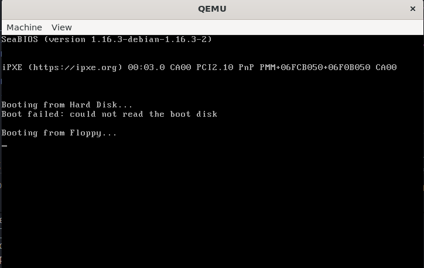

# K-OS 
## Introduction
- So, to build an OS from scratch, I have first used the assembly language to start with and later on shifting to C/C++.
- Processors understand assembly codes and all the processors are backward compatible.
- Different processors have their different assembly instructions.
- For my OS I will be using x86 architecture, which means I'll be using x86 assembly language.

Let's now look at some of the basics before directly jumping into making of an OS.
---
## Boot Process
- BIOS (Basic Input Output System) initiates all the tasks, including on screen graphics as well as booting up the operating system.
- BIOS can load an operating system into two ways:
    
    **1. Legacy Booting:** The BIOS loads the first block of data (the first sector) from each boot device into memory, until it finds a certain signature (0xAA55). Once it finds that signature, it jumps to the first instruction in the loaded block and this is where our operating system starts.

    **2. EFI (Extensive Firmware Interface):** BIOS looks for a certain EFI partition on each device, which contains speacial EFI programs.

- BIOS always puts our OS at address 0x7C00.
---
## Writing code in Assembly
- An assembly code consists of two things in primary which are:

    **1. Directive:** A way of giving assembler a clue how to interpret our code (It don't get translated).
    **2. Instruction:** It is translated into a machine code instruction.
- I will writing the assembly code in the directory named src with the file main.asm. 
#### Code:
```nasm
org 0x7C00  ; org tells assembler to calculate all memory offsets starting at 0x7C00
bits 16     ; bits is a directive

main:
    hlt

.halt
    jmp .halt ; an infinite loop to keep the system on

times 510 - ($ - $$) db 0
dw 0AA55h
```
- **Understaning above instructions:**
    
    *1. db:* it declares constant bytes (Directive).

    *2. times:* used to repeat instruction or data (Directive).

    *3. $:* used to obtain assembly position of the begining of the current line.

    *4. $$:* gives us the position of the begining of the current section.

    *5. dw:* same as db, but declares two bytes constant (a word).
---
## Writing the Makefile
To write this Makefile I have created a new directory call "build" in order to keep things organised. Here at first I am building main.asm using nasm and getting my output in a binary format. Then after which I use that binary formated file and build a disk image and fill it with zeroes until it has 1.44 megabytes(standard floppy size) of storage.

 ```make
ASM= nasm
src_dir= src
build_dir= Build

$(build_dir)/main_floppy.img : $(build_dir)/main.bin
	cp $(build_dir)/main.bin $(build_dir)/main_floppy.img
	truncate -s 1440k $(build_dir)/main_floppy.img

$(build_dir)/main.bin : $(src_dir)/main.asm 
	$(ASM) $(src_dir)/main.asm -f bin -o $(build_dir)/main.bin
```
---
## First Test 
To test the following codes I am using qemu as my virtual machine (any other virtual machine such as VirtualBox or VMWare can be used).

In order to run the built OS type-in the following command:
```bash
qemu-system-i386 -fda build/main_floppy.img
```
Which boots on the system from floppy.



So far my Operating System does nothing and does it perfectly!
